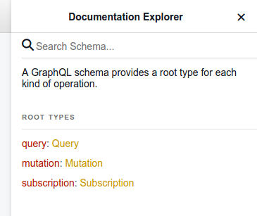

# documentation
The server implements the following Graphql operations:
- [Queries](queries.md)
- [Mutations](mutations.md)
- [Subscriptions](subscriptions.md)

## Graphiql
Graphiql client provides the documentation of the schema in the *documentation explorer* section.

